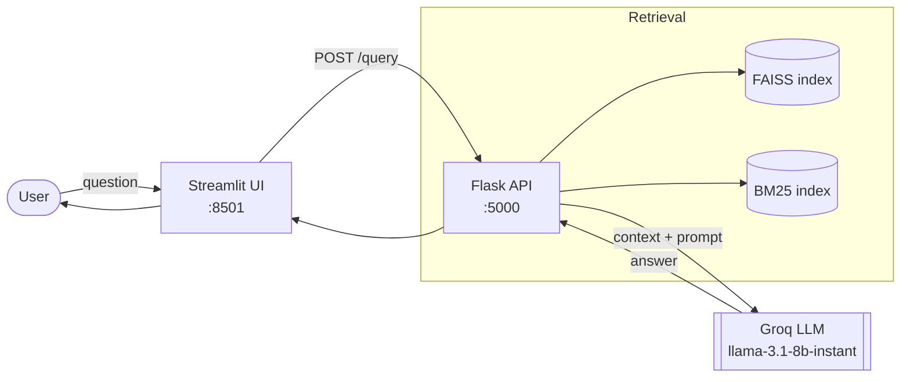

# 🤖 Anchor — RAG HR Assistant

Anchor is a **Retrieval-Augmented Generation (RAG)** chatbot that answers employee HR
questions — leave, payroll, benefits, remote work, compliance — grounded strictly in
your own HR policy documents. It pairs **hybrid retrieval** (FAISS + BM25) with a
**Groq-hosted LLM** and wraps it in a polished, premium Streamlit interface.


---

## ✨ Features

- **Grounded, generative answers** — replies are synthesized in a natural, conversational
  voice but every fact comes only from your policy documents (no hallucinated numbers).
- **Hybrid retrieval** — dense vector search (FAISS, cosine) unioned with lexical search
  (BM25), score-normalized and combined so neither retriever hides a relevant passage.
- **Source citations** — every answer can be expanded to show the exact passages it used.
- **Conversational memory** — per-session chat history with idle eviction.
- **Performance & safety** — response caching, per-session rate limiting, input-size caps,
  and optional API-key auth.
- **Premium UI** — a custom design system (glassmorphism, motion, avatars, suggestion
  cards, live status) that feels like a SaaS product, not a stock Streamlit app.
- **Dockerized** — one command brings up backend + frontend.

---

## 🏗️ Architecture



**Offline ingestion** (run once to build the knowledge base):

```
data/HR-Policy.pdf
  └─ utils/ingest.py      → extract + chunk        → data/hr_chunks.json
       └─ utils/embeddings.py → embed (MiniLM)     → models/embeddings.pkl, chunks.pkl
            └─ utils/faiss_index.py → index         → models/faiss_index.index, bm25.pkl
```

---

## 🧰 Tech Stack

| Layer      | Technology                                             |
| ---------- | ------------------------------------------------------ |
| Frontend   | Streamlit + custom CSS design system                   |
| Backend    | Flask REST API                                         |
| Embeddings | `sentence-transformers` (`all-MiniLM-L6-v2`)           |
| Retrieval  | FAISS (dense) + `rank-bm25` (lexical)                  |
| LLM        | Groq — `llama-3.1-8b-instant`                          |
| Ingestion  | `pdfplumber` + LangChain text splitter                 |

---

## 📁 Project Structure

```
.
├── app/backend/app.py      # Flask API: /query, /reset, /health
├── frontend/
│   ├── app.py              # Streamlit UI (logic & layout)
│   └── styles.css          # Design system (tokens, components, motion)
├── utils/
│   ├── ingest.py          # PDF → text → chunks
│   ├── embeddings.py      # chunks → embeddings
│   └── faiss_index.py     # embeddings → FAISS + BM25 indexes
├── data/                   # HR-Policy.pdf, hr_chunks.json
├── models/                 # Serialized embeddings & indexes
├── Dockerfile
├── docker-compose.yml
├── requirements.txt
└── README.md
```

---

## 🚀 Getting Started

### Prerequisites

- Python 3.11 (3.9+ works)
- A free **Groq API key** — <https://console.groq.com>
- Docker (optional, for containerized deployment)

### 1. Clone & install

```bash
git clone https://github.com/LikithGS11/RAG-HR-CHATBOT.git
cd RAG-HR-CHATBOT
python -m venv venv
source venv/bin/activate        # Windows: venv\Scripts\activate
pip install -r requirements.txt
```

### 2. Configure your key

Create a `.env` file in the project root:

```
GROQ_API_KEY=your_groq_api_key_here
```

### 3. Build the knowledge base

Place your policy PDF at `data/HR-Policy.pdf`, then run the ingestion pipeline once:

```bash
python utils/ingest.py
python utils/embeddings.py
python utils/faiss_index.py
```

### 4. Run

```bash
# Terminal 1 — backend
python app/backend/app.py

# Terminal 2 — frontend
streamlit run frontend/app.py
```

Open <http://localhost:8501>.

---

## 🐳 Docker

Bring up backend and frontend together (reads `GROQ_API_KEY` from your `.env`):

```bash
docker-compose up --build
```

Frontend → <http://localhost:8501>, backend → <http://localhost:5000>.

---

## ⚙️ Configuration

| Variable        | Required | Default                 | Description                                                            |
| --------------- | -------- | ----------------------- | ---------------------------------------------------------------------- |
| `GROQ_API_KEY`  | ✅       | —                       | Groq API key used for LLM generation.                                  |
| `BACKEND_URL`   | ❌       | `http://localhost:5000` | URL the frontend uses to reach the backend.                            |
| `APP_API_KEY`   | ❌       | *(unset)*               | If set, callers must send it as `X-API-Key` on `/query` and `/reset`.  |
| `FLASK_DEBUG`   | ❌       | `false`                 | Enable Flask debug mode. **Never enable in production.**               |

---

## 🔌 API Reference

| Method | Endpoint  | Body                              | Description                          |
| ------ | --------- | --------------------------------- | ------------------------------------ |
| `GET`  | `/health` | —                                 | Liveness check + indexed chunk count |
| `POST` | `/query`  | `{ "query", "session_id?" }`      | Ask a question; returns answer + sources |
| `POST` | `/reset`  | `{ "session_id" }`                | Clear a session's history and cache  |

```bash
curl -X POST http://localhost:5000/query \
  -H "Content-Type: application/json" \
  -d '{"query": "How many earned leaves do I get?"}'
```

---

## 🔒 Security Notes

- Never commit `.env` or API keys — it is git-ignored by default.
- Set `APP_API_KEY` and keep `FLASK_DEBUG=false` before any public deployment.
- Expose only the ports you need and run behind a proper WSGI server in production.

---

## 🗺️ Roadmap

- [ ] Streaming (token-by-token) responses in the UI
- [ ] Multi-document ingestion and document management
- [ ] Persist sessions/cache in Redis instead of in-memory
- [ ] Automated tests (retrieval + API) and CI
- [ ] Production WSGI server (gunicorn/waitress) in the backend image

---

## 👤 Author

Developed by **Likith**.
